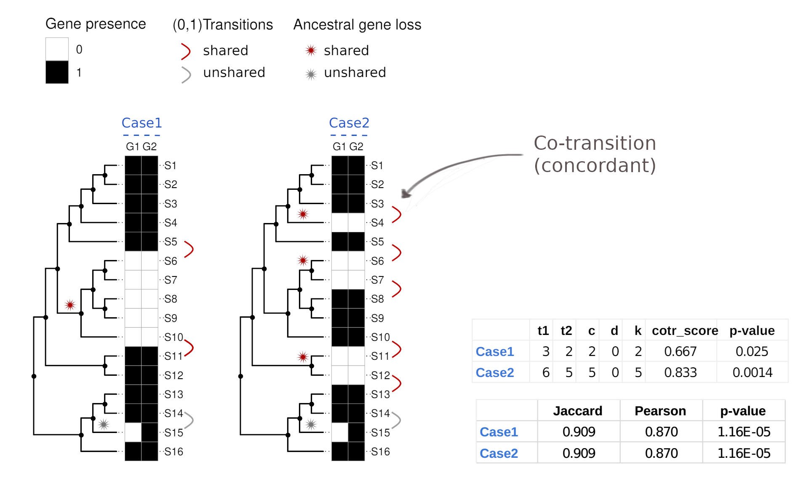

# Cotransitions
Statistical analysis of co-evolutionary transitions among genes.<br><br>
[](https://doi.org/10.5281/zenodo.7578797) 
<br><br>


Pipeline in python3 and R to perform coevolutionary analysis
## Installation

### Requirements
Any version of [Conda](https://docs.conda.io/en/latest/) or [Miniconda](https://docs.conda.io/en/latest/miniconda.html)

```{bash}
git clone https://github.com/lab83bio/Cotransitions.git
cd Cotransitions
source cotr_install
```
The installation is successful if `(cotr)` in the command line prompt

```console
(cotr) user@pc:~/Cotransitions$ 
```

## Usage
To run the whole pipeline with **OrthoDB**:

```bash
./cotr_pipeline
```

[you can modify with your parameters the `cotr_pipeline` VARIABLES section] <br>
```bash
level="Eukaryota" #"Bacteria", "Archaea" (faster), "Mammalia", etc
tree="raxml" #raxml|ncbi|random
ladder=("RL" "LL" "NL") #tree orientation (RL=right-ladderized)
ncores=25
```
### Usage with OMA HOGs
To run the whole pipeline with OMA HOGs, please install cotr_extra envinroment with:

```{bash}
source cotr_extra_install
```

then you can run
```bash
./cotr_pipeline_OMA.sh
```

## Notebook usage

[*Concordant.ipynb*](https://github.com/lab83bio/Cotransitions/blob/master/Notebook/Concordant.ipynb) and
[*Validation.ipynb*](https://github.com/lab83bio/Cotransitions/blob/master/Notebook/Validation.ipynb) files can be opened with `jupyter-lab` included in `cotr_extra` conda environment <br>
The whole analysis can be performed by clicking ⏩ "Restart kernel and run all cells..."

## How transitions are counted and scored

A "transition" is a change in the gene distribution vector. When two genes (orthogroups) share the same transition at the same position (e.g. 1/0, 1/0), a concordant transition is counted.



Conversely, when two genes (orthogroups) share the opposite transition at the same position (e.g. 1/0, 0/1), a discordant transition is counted (see [this figure](./Figures/Figure1B/Concordant_Supplementary_Figures_revision_FigS1.png)).

The cotransition (cotr) score and significance are comuputed form the number of concordant (c), discordant (d), and total transitions (t1, t2).
The values shown for "Case1" can be obtained with the following command:
```bash
./cotr_transitions.py Figures/Figure1B/Figure1B_Case1.csv.num | ./cotr_Fisher.r -
```
